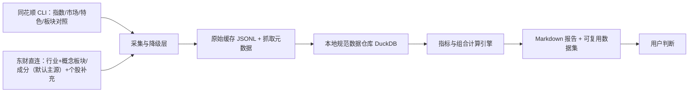

# 市场全景辅助决策系统需求说明书

| 项 | 内容 |
| --- | --- |
| 文档版本 | v1.1-draft |
| 状态 | 待评审 |
| 日期 | 2026-08-18 |
| 适用模块 | `market_overview/`、`market_data/`、本地数据底座与报告输出 |
| 取代关系 | 本文件取代 `docs/design/market-overview-sector-tracking.md`（v0.3 草案），作为重新推进的唯一需求基线 |
| 当前实现 | M0–M5 与 Markdown 报告已落地；P2 项（筹码结构、HTML/PDF 等）后置 |

## 1. 背景与定位

本项目从「A 股行情接入」演进为「面向个人投研的市场全景辅助决策工具」。系统只做
**信息组织、统计、跟踪与风险测量**，不做自动化交易，也不给出最终买卖结论。

系统按以下主线组织信息：

1. 市场整体的客观状态与量能变化；
2. 市场内板块之间的强弱、回撤与资金/量能变化；
3. 板块内个股之间的地位关系；
4. 个股自身的技术状态；
5. 给定持仓后，组合整体的 β、集中度与暴露。

每一层都要回答一个明确的决策问题，并且必须能追溯到原始数据与计算口径。

## 2. 现状评估与差距

当前分支 `feature/market-overview-sector-tracking` 已有 M0 抓取层、缓存和报告
骨架，但它只是「一次抓取 + 单日快照」，尚未构成可多日连续跟踪的体系。差距如下：

| 主题 | v1.0 基线时已有 | 与目标差距 |
| --- | --- | --- |
| 市场层 | 抓取基准指数日线 | 无量能趋势、全市场宽度、涨跌停/炸板/连板、市场状态判断 |
| 板块层 | 抓取全部行业/概念板块列表，仅取 3 个样例板块的历史与成分 | 无全板块多日快照积累、强度/相对强度/回撤/量能趋势、板块间对比 |
| 板块内个股层 | 抓取样例板块的成分股快照 | 无市值分组、个股相对板块地位、贡献度与多日跟踪 |
| 个股层 | 抓取组合内个股后复权日线与市值/换手率 | 无换手率趋势、形态指标、筹码结构及可选基本面证据 |
| 组合层 | 支持「代码 + 权重」输入 | 无 β、相关系数、HHI、分散化比率、行业暴露；不支持股数/市值输入 |
| 数据底座 | JSONL 缓存，每次覆盖写入 | 无按 `trade_date` 追加、无幂等 upsert、无 `as_of` 字段、无规范数据仓库 |
| 指标计算 | 无，报告中只有占位说明 | M1–M5 指标全部未落地 |
| 需求表述 | 设计草案混有实现进度、字段验证、里程碑 | 缺少可验证的功能需求、验收标准、优先级与非功能要求 |

结论：现有 M0 代码可以作为「远端抓取与缓存」的参考实现继续沿用，但不能作为
后续推进的需求基线。新基线以本文件为准。

## 3. 目标与非目标

### 3.1 目标

- 以日线节奏完成「市场 → 板块 → 板块内个股 → 个股 → 组合」五层证据链；
- 对市场量能、板块变化、板块内关系、个股状态进行多日连续跟踪；
- 给定几只股票后，计算组合 β、相关性、集中度与分散程度；
- 所有结论可复现：数据带来源、时间戳、窗口与复权口径，指标有固定公式；
- 真实数据不可用时如实标注缺口，不使用模拟或近似数据冒充真实数据。

### 3.2 非目标

- 不做自动化下单、盯盘交易或实时推送指令；
- 不输出荐股、买卖点、目标价或收益承诺；
- 不把「强度、热度」等统计量直接解释为投资结论；
- 首版不承诺盘中实时流式更新，快照与日线优先；
- 首版不承诺筹码结构的结论化指标，只做可得性验证。

## 4. 用户与使用场景

| 场景 | 输入 | 期望输出 |
| --- | --- | --- |
| 每日复盘 | 前一交易日市场数据 | 市场量能与宽度摘要、板块强弱排名、领涨/领跌板块及变化 |
| 板块跟踪 | 关注的板块或行业/概念范围 | 多日强度、上涨后回撤、量能配合与板块内个股结构 |
| 个股观察 | 若干自选股票代码 | 换手率趋势、形态指标、相对板块/大盘状态 |
| 组合风险 | 持仓代码及权重/股数/市值 | 组合 β、相关系数矩阵、HHI、分散化比率、行业暴露 |

## 5. 总体架构与数据流



职责边界：

- `market_data/` 只负责行情访问与降级，不直接进入业务指标；
- `market_overview/` 负责采集编排、规范存储、指标计算与报告；
- 金融取数优先走 hithink-finance 系列 CLI/技能，板块与个股补充信息走东财；
- 缓存与仓库落在不入库的 `data/` 目录，凭据永不写盘入库。

## 6. 功能需求

优先级定义：P0 = 首版必须；P1 = 首版应做，可受数据源限制降级；P2 = 后置。

### 6.1 分层信息模型

| 层 | 核心问题 | 关键指标 | 主要来源 |
| --- | --- | --- | --- |
| 市场 | 现在环境是扩张、收缩还是中性？ | 成交额趋势、涨跌家数、涨跌停/炸板/连板、指数趋势 | hithink index/market/special-data |
| 板块 | 主线在哪里，是强化、回撤还是退潮？ | 板块涨跌幅、相对强度、回撤、量能趋势 | 东财行业+概念板块（默认），同花顺行业+概念指数（对照） |
| 板块内个股 | 谁是核心、谁在掉队？ | 市值分组、相对板块超额、贡献度、量能 | 东财板块成分 + 同花顺成分对照 |
| 个股 | 个股自身状态如何？ | 换手率趋势、形态、筹码（P2）、估值/事件（可选） | hithink + 腾讯/东财补充 |
| 组合 | 组合整体暴露和分散程度？ | β、相关性、HHI、分散化比率、行业暴露 | 个股后复权收益 + 基准 |

### 6.2 市场层

| ID | 需求 | 验收标准 | 优先级 |
| --- | --- | --- | --- |
| FR-M1 | 抓取并保存可配置基准指数的日线 OHLC、成交量与成交额 | 默认 `000001.SH`，可切换 `000300.SH` 等；数据含 `trade_date`、`source`、`as_of` | P0 |
| FR-M2 | 抓取全市场或基准市场日成交额序列 | 至少 60 个交易日可对账；重复抓取不重复落库 | P0 |
| FR-M3 | 计算量能变化趋势：当日/5日/20日均量、量比、环比、5日前同比、60/120日分位 | 每个数值可由原始数据重算 | P0 |
| FR-M4 | 统计市场宽度：上涨/下跌/平盘家数 | 与 `market snapshot` 分页接口对账；每日一条记录 | P1 |
| FR-M5 | 统计涨跌停家数、炸板率、连板高度 | 走 special-data；缺数据时明确标注，不用涨停池推断 | P1 |
| FR-M6 | 输出市场状态摘要：扩张/收缩/中性 | 状态由固定规则推导，报告中列出规则输入与阈值 | P1 |

### 6.3 板块层

| ID | 需求 | 验收标准 | 优先级 |
| --- | --- | --- | --- |
| FR-B1 | 板块范围默认东财行业 + 概念板块（`em.boards`），同花顺行业 + 概念指数（`index catalog`）保留为对照，不做地域板块 | 每次抓取两套板块代码集合稳定可对账；目录缺失时报错 | P0 |
| FR-B2 | 每日保存全部板块快照：涨跌幅、成交额、成交量、换手率 | 按 `(trade_date, thscode, source)` 幂等 upsert，重复运行不产生重复行 | P0 |
| FR-B3 | 对关注板块做历史回填；东财默认以每日快照累计自建序列，原生日线作为可选增强 | 同花顺指定窗口内日线可重算；东财快照累计天数在报告中可见；失败可断点续跑并记录 | P1 |
| FR-B4 | 计算板块 N 日涨跌幅、相对大盘超额、区间最大回撤、涨幅/回撤比 | 至少支持 N=5/10/20；每个值可由收盘价序列重算 | P0 |
| FR-B5 | 计算板块量能变化趋势与「缩量回撤/放量回撤」标注 | 回撤定义与量能阈值固定；输出原始量能供核验 | P0 |
| FR-B6 | 输出板块间对比：按强度、回撤、量能排序，并与上一交易日对比变化 | 报告同时显示 top 与 bottom；变化列注明计算窗口 | P1 |
| FR-B7 | 板块资金流或资金代理指标 | 若有可用资金流接口则用接口；否则用「成交额占比变化」并明确标注为代理，不得冒充真实资金流 | P2 |
| FR-B8 | 支持用户配置关注板块集合 | 未配置时按默认规则取重点板块，配置后只跟踪配置集合 | P1 |

### 6.4 板块内个股层

| ID | 需求 | 验收标准 | 优先级 |
| --- | --- | --- | --- |
| FR-I1 | 每日保存关注板块的成分股快照：价格、涨跌幅、成交量/额、换手率、总/流通市值 | 按 `(as_of, board_thscode, symbol, source)` 幂等 upsert | P0 |
| FR-I2 | 按总市值/流通市值分组（大/中/小盘） | 阈值由全市场分布确定，报告显示分组边界 | P1 |
| FR-I3 | 计算个股相对板块的 N 日超额收益与量能趋势 | N 可配置；个股与板块同口径同窗口 | P1 |
| FR-I4 | 标注个股在板块中的地位：领涨、跟随、掉队 | 分类规则固定且可解释；输出规则输入值 | P1 |
| FR-I5 | 计算个股对板块涨跌的近似贡献度 | 至少用成交额加权近似；报告标注近似口径 | P2 |
| FR-I6 | 支持板块内「涨跌幅 × 市值」分组汇总 | 输出各市值分组的家数、平均涨幅、成交额占比 | P1 |

### 6.5 个股层

| ID | 需求 | 验收标准 | 优先级 |
| --- | --- | --- | --- |
| FR-S1 | 管理自选/持仓股票清单，抓取后复权日线 | 股票代码 6 位，自动映射 thscode 与东财 secid | P0 |
| FR-S2 | 保存个股当日市值、股本、换手率补充信息 | 东财失败时标缺失，不影响其他个股 | P0 |
| FR-S3 | 计算换手率趋势：当日值、5/20 日均值 | 原始值与趋势同时输出 | P1 |
| FR-S4 | 用日线派生形态指标：均线排列、N 日新高/新低、振幅、最大回撤、量比 | 只输出客观指标，不输出主观形态结论 | P1 |
| FR-S5 | 筹码结构可行性验证 | 明确数据源可得性；不可得时输出「不可用」而非近似值 | P2 |
| FR-S6 | 可选输出估值、财务摘要与异动原因 | 作为辅助证据，缺数据时标注；不自动形成结论 | P2 |

### 6.6 组合层

| ID | 需求 | 验收标准 | 优先级 |
| --- | --- | --- | --- |
| FR-P1 | 支持三种持仓输入：代码+权重、代码+股数、代码+当前市值 | 权重输入需合计为 1；股数/市值输入按最新价自动归一；允许现金记为 0 波动资产 | P0 |
| FR-P2 | 构造组合日收益序列 | 使用后复权收盘，按共同交易日对齐；停牌日按 0 收益并单独计数 | P0 |
| FR-P3 | 计算组合 β | 同时输出「加权个股 β」与「组合收益回归 β」两种口径，并标注方法差异 | P0 |
| FR-P4 | 计算组合与基准相关性、平均两两相关系数与相关系数矩阵 | 报告窗口、样本天数、缺失日 | P1 |
| FR-P5 | 计算集中度：HHI、有效持仓数、最大权重、分散化比率 | 公式固定；分散化比率小于 1 时不得解释为风险好坏的唯一依据 | P1 |
| FR-P6 | 计算行业/板块暴露 | 依赖成分/板块归属数据；归属缺失时单独列出 | P2 |
| FR-P7 | 支持基准与窗口配置 | 基准默认沪深 300（待确认），窗口默认 120 交易日，可切换 | P0 |
| FR-P8 | 输出 β 结果同时包含 α、R²、样本数、缺失日数 | 数值可由原始收益序列重算 | P1 |

### 6.7 数据底座

| ID | 需求 | 验收标准 | 优先级 |
| --- | --- | --- | --- |
| FR-D1 | 建立本地 DuckDB 规范仓库，区分原始表与派生表 | 建表脚本可重复执行；表结构有注释 | P0 |
| FR-D2 | 所有行带 `trade_date`、`source`、`as_of`、`ingest_time`，东财补充行情另带 `delayed` | 抽查任意数据行都能回答「何时、来自哪里、是否延迟」 | P0 |
| FR-D3 | 每日同步幂等，可重复运行与断点续跑 | 同一天重复运行不产生重复行；失败条目可单独重试 | P0 |
| FR-D4 | 支持历史回填与增量更新 | 先回填再增量；回填窗口可配置 | P1 |
| FR-D5 | 抓取失败不静默丢数据，错误进入状态表并出现在报告 | 报告「数据状态」列出缺失项与原因 | P0 |
| FR-D6 | 原始缓存与规范仓库分离，缓存不入库 | `data/` 在 `.gitignore` 中 | P0 |

### 6.8 报告与输出

| ID | 需求 | 验收标准 | 优先级 |
| --- | --- | --- | --- |
| FR-R1 | 每日生成 Markdown 报告 | 固定包含：市场、板块、板块内个股、个股、组合、数据状态六部分 | P0 |
| FR-R2 | 每项统计显示窗口、基准、来源与生成时间 | 未计算项只显示「未实现/不可用」，不显示伪造值 | P0 |
| FR-R3 | 同时输出机器可读的派生数据集 | 派生表或 Parquet/JSONL 文件路径在报告中列出 | P1 |
| FR-R4 | 后续支持 HTML/PDF 渲染 | 首版不强制，保留 Markdown 源 | P2 |

## 7. 指标口径

所有强度类指标遵循「定义 → 样例验证 → 固定口径」三步，本节定义 v1 口径，实现
阶段先用真实数据验证再最终冻结。

### 7.1 量能变化趋势

给定日成交额序列 `A_t`：

```text
MA5  = 近 5 日均额
MA20 = 近 20 日均额
量比_t = A_t / MA20
5/20 均量比 = MA5 / MA20
环比_t = A_t / A_{t-1} - 1
5 日同比_t = A_t / A_{t-5} - 1
分位_t = A_t 在近 60/120 日均额中的百分位
```

市场量能默认以基准指数成交额为主指标；全市场成交额可用时作为并列列，不用来替代。

### 7.2 市场宽度与情绪

```text
上涨/下跌/平盘家数：来自全市场快照分页
涨停家数、跌停家数：来自 special-data
炸板率 = 炸板家数 / (涨停家数 + 炸板家数)
连板高度 = 当日最高连续涨停天数
```

市场状态 v1 规则只做「事实标注」，例如：量能扩张且上涨家数占优时标「扩张」，
量能收缩且下跌家数占优时标「收缩」，其余标「中性」。阈值先用样例数据标定，
不直接写死到代码中。

### 7.3 板块强度与回撤

给定板块收盘序列 `P_t` 与基准收盘序列 `B_t`：

```text
板块 N 日涨幅  = P_t / P_{t-N} - 1
相对强度      = 板块 N 日涨幅 - 基准 N 日涨幅
区间最大回撤  = min(P_s / max_{u<=s} P_u - 1)，s 在 N 日窗口内
涨幅/回撤比   = N 日涨幅 / max(|区间最大回撤|, epsilon)
量能回撤标注  = 收盘低于区间高点且量能低于 MA20 -> 缩量回撤
                收盘低于区间高点且量能高于 MA20 -> 放量回撤
```

板块换手率趋势用东财板块历史自带换手率字段，作为热度辅助列。

### 7.4 板块内个股地位

```text
相对板块超额 = 个股 N 日涨幅 - 所属板块 N 日涨幅
量比         = 个股当日成交量 / 近 20 日均量
近似贡献度   = 个股成交额 / 板块成交额 × 个股涨跌幅（近似口径，需标注）
```

地位分类 v1 由相对超额与贡献度共同决定，例如板块上涨时：

- 领涨：超额为正且贡献度靠前；
- 跟随：涨幅为正但超额不突出；
- 掉队：板块为正而个股超额为负。

具体阈值待市值分布与样例数据验证后冻结。

### 7.5 个股形态

只输出客观派生值，不输出主观形态名称：

```text
均线多头/空头计数：close 与 MA5/10/20/60 的位置
N 日新高/新低
区间振幅
区间最大回撤
量比（当日量 / 近 20 日均量）
```

### 7.6 组合 β 与集中度

个股日收益与组合日收益使用后复权价格：

```text
r_i,t = close_i,t / close_i,t-1 - 1
r_p,t = Σ w_i × r_i,t
个股 β_i = Cov(r_i, r_m) / Var(r_m)
加权组合 β = Σ w_i × β_i
回归组合 β = Cov(r_p, r_m) / Var(r_m)
```

集中度：

```text
HHI = Σ w_i²
有效持仓数 = 1 / HHI
分散化比率 = 组合波动率 / Σ(w_i × 个股波动率)
平均两两相关系数 = mean(Corr(r_i, r_j))
```

停牌/缺失日按共同交易日对齐，不作插值；输出必须标注窗口、基准与权重口径。

## 8. 数据源与路由

路由规则：

- 板块目录、板块快照、板块成分：默认东财（行业 + 概念），`market_data/em.py`
  的「实时线 → 延迟线」与「系统代理 → 直连 → curl」逐层回退；同花顺行业 +
  概念目录/快照/历史保留为对照；
- 指数目录/历史、全市场宽度与特色数据：优先 hithink-finance CLI；
- 板块多日历史：同花顺指数历史为主；东财原生日线（push2his）在部分 VPN 出口
  受风控，因此东财多日指标默认由「每日板块快照累计」自建序列，`--em-history`
  可选尝试原生日线回填，失败仅记警告；
- 个股日线历史：hithink 本地库可用时优先；本机未初始化或接口不可用时回退腾讯
  `akshare`，来源字段如实标注；
- 个股市值/股本/换手率补充：东财直连，统一复用 `market_data/em.py` 的
  「系统代理 → 直连 → curl」与实时线 → 延迟线通道；
- 筹码结构：当前无已确认来源，标记为数据缺口。

已实测字段与数据缺口沿用 `docs/design/market-overview-sector-tracking.md`
第 3 节的验证记录，本文件不再重复逐字段清单，但要求实现时必须保持该节中的
机器级注意事项：本机 DuckDB 未初始化时显式 `--source remote`、复用 `em.fetch`、
凭据不落盘。

## 9. 数据模型与更新策略

规范仓库建议至少包含以下表：

```text
symbol_meta              标的元数据
trading_calendar         交易日历
market_index_daily       基准/指数日线
market_breadth_daily     全市场涨跌家数
market_special_daily     涨停/跌停/炸板/连板
board_meta               板块元数据
board_daily              板块日快照与日线
board_constituent_daily  板块成分股日快照
stock_daily              个股后复权日线
stock_profile_daily      个股当日市值/股本/换手率
portfolio_holdings       组合输入与权重
derived_*                派生指标表
```

关键约定：

- `trade_date` 表示数据所属交易日；
- `as_of` 表示「该数据是在哪个时点看到的」，快照类数据按抓取日记录，历史类数据
  按 `trade_date` 记录；
- `ingest_time` 表示本地入库时间；
- 行情快照必须携带 `delayed` 标记；
- 东财板块代码统一以 `EM:` 命名空间入库（如 `EM:BK1627`），与同花顺 `thscode`
  （如 `881273.TI`）天然区分，两套口径不混算；主键建议使用
  `(trade_date, code, source)`，用 upsert 保证重复抓取幂等；
- 回填与增量更新必须遵守同一套主键与口径，不允许同一张表出现两种复权口径。

每日流程建议为：抓取 → 原始缓存 → 校验 → 写入规范表 → 计算指标 → 渲染报告。
收盘后运行；盘中手动运行时要在报告显著位置标注数据时点与延迟状态。

## 10. 非功能需求

| 类别 | 要求 |
| --- | --- |
| 可靠性 | 单源失败不影响其他源；失败原因可追溯；可断点续跑 |
| 性能 | 默认关注集合抓取应在常规网络下合理时间完成；全量板块回填走批处理并限速 |
| 安全 | API Key 只走机器级凭据，不写代码、日志、文档、Git |
| 可复现 | 同一窗口、同一数据版本重算得到同一指标；指标函数无随机性 |
| 防未来函数 | 历史回填不得使用晚于 `as_of` 的数据；复权价格与成交额口径分开 |
| 数据诚实 | 无数据时输出「不可用」及原因，不生成模拟值 |
| 可移植 | 双机各自建 `.venv` 与本地库；源码统一 LF/UTF-8 |
| 可维护 | 指标口径集中在独立模块，报告渲染与指标计算分离 |

## 11. 里程碑

| 阶段 | 交付物 | 验收 | 对应需求 |
| --- | --- | --- | --- |
| M0 | 规范仓库与采集基础 | 建表可重复、持仓输入三格式可用、每日 upsert 幂等、原 M0 抓取层改造可运行 | FR-D1–D6、FR-P1 |
| M1 | 市场层 | 量能趋势、宽度、涨跌停/炸板/连板与市场状态摘要可输出 | FR-M1–M6 |
| M2 | 板块层 | 全板块快照累计、N 日强度/相对强度/回撤/量能趋势、板块排名报告 | FR-B1–B8 |
| M3 | 板块内个股层 | 市值分组、相对板块超额、地位分类与分组汇总 | FR-I1–I6 |
| M4 | 个股层 | 换手率趋势、形态指标；筹码可得性验证 | FR-S1–S6 |
| M5 | 组合层 | 加权 β 与回归 β、相关性矩阵、HHI、分散化比率 | FR-P2–P8 |
| M6 | 报告完善 | HTML/PDF 或 Agent 摘要（可选） | FR-R4 |

M0 是重新推进的第一道门槛：在指标未实现前，先把「多日、可追溯、可重复」的
数据底座立住，避免继续沿用覆盖式缓存。

## 12. 假设与待确认事项

| 事项 | 建议默认 | 说明 |
| --- | --- | --- |
| 市场量能基准 | 上证指数成交额 | 与现有方案一致，另列全市场成交额 |
| 组合 β 基准 | 沪深 300 | 比上证指数更能代表股票组合，仍可切换 |
| β 统计窗口 | 120 个交易日 | 60 日对 A 股偏短；报告可同时显示 60/120 日敏感性 |
| 持仓输入 | 权重、股数、市值三选一并支持现金 | 权重合计为 1 时使用权重；否则按市值归一 |
| 市值分组阈值 | 用全市场分布标定后冻结 | 不在实现前拍固定数值 |
| 板块资金流 | 无可靠接口时用成交额占比变化代理并标注 | 不得冒充真实资金流 |
| 筹码结构 | P2 后置 | 先验证东财筹码分布接口可得性 |
| 报告格式 | 首版 Markdown | 后续再考虑 HTML/PDF |
| 全板块历史范围 | 每日快照累计为主，重点板块历史按需回填 | 避免无谓的全量请求 |
| 板块体系 | 东财行业+概念为主，同花顺行业+概念保留对照 | 东财板块快照/成分可用；原生日线历史受 VPN 风控 |
| 东财板块多日历史 | 每日快照累计自建序列，原生日线可选 | 快照累计不足时报告如实标注天数，不用近似值冒充 |

以上默认值若与预期不符，需在 M0 开工前确认并更新本表。

## 13. 变更记录

| 版本 | 日期 | 说明 |
| --- | --- | --- |
| v1.0-draft | 2026-08-18 | 取代 v0.3 设计草案，补充分层需求、验收标准、指标口径与数据底座要求 |
| v1.1-draft | 2026-08-18 | 板块体系切换为东财行业+概念默认主源，同花顺保留对照；东财多日指标改为每日快照累计 |
